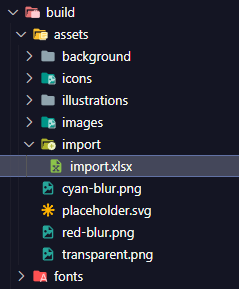

# Build React sang file thực thi bằng Pkg

## Bước 1:

Thay file import.xlsx tại đường dẫn sau:

## Bước 2:

Sử dụng lệnh yarn hoặc npm i để cài các phụ thuộc của dự án.

## Bước 3:

Sử dụng lệnh npm i -g pkg để cài pkg vào global.

## Bước 4:

Sử dụng lệnh pkg . (Bao gồm dấu .) để bắt đầu build file thực thi.

## Bước 5:

Copy file thực thi (nằm trong folder dist) vào thư mục bin (thư mục ngang vào với IITLauncher.exe)
